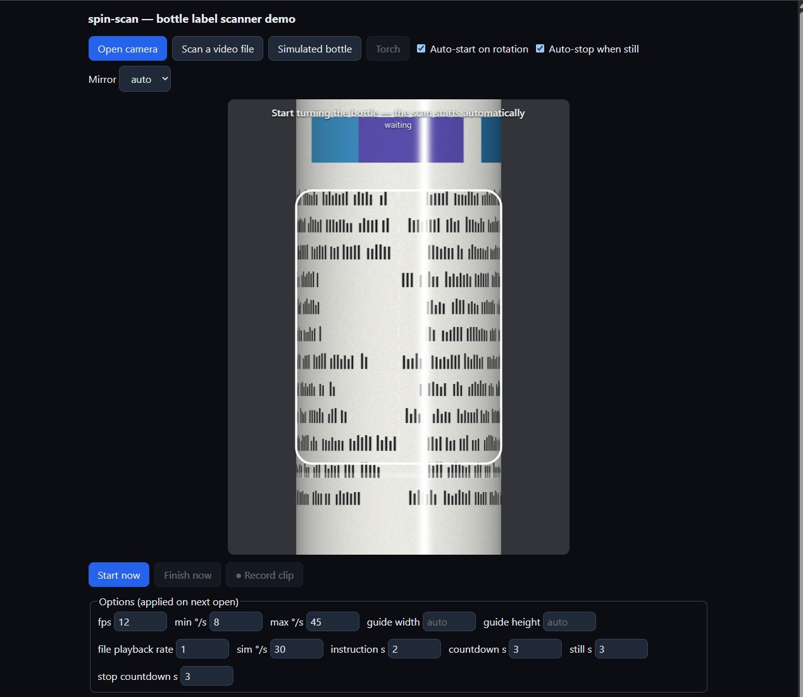

# spin-scan

Scan the label of a rotating cylinder (e.g. a medication bottle) with a phone/laptop camera and get **one flat, unwrapped image** of the whole label — ready to hand to an OCR engine of your choice.

- TypeScript, compiled to ESM + CJS with type definitions
- Runs entirely in the browser (no server, no WASM, no runtime dependencies)
- Framework-agnostic core + React hook/component (`"use client"`, works in Next.js App Router)
- Live user guidance: rotation speed, blur, glare, lighting, steadiness, progress
- Works from a live camera or a recorded video clip



> OCR is intentionally **not** part of this library. It produces an image; run OCR (Tesseract, a cloud API, etc.) on it afterwards.

## Privacy and camera access

Camera frames and video are processed locally in the browser. The library does not upload or persist them. Your application decides what to do with the resulting image; for example, the React example below explicitly sends it to `/api/ocr`.

Camera access requires the user's permission and a secure context (HTTPS or `localhost`). The library requests video only, not microphone audio.

## Install

```bash
npm install spin-scan
```

## Usage (vanilla)

```ts
import { CylinderScanner } from 'spin-scan';

const video = document.querySelector('video')!;
const scanner = new CylinderScanner();

scanner.on('state', (s) => {
  hint.textContent = s.message;            // "Slow down", "Glare detected…", "Good — keep going (40%)"
  drawGuide(s.videoSize, s.guide);         // rectangle (video px) the bottle should be lined up with
  video.style.transform = s.mirrored ? 'scaleX(-1)' : '';  // selfie-style preview for webcams/front cameras
});
scanner.on('complete', async (result) => {
  const png = await result.toBlob('image/png');
  // → send to OCR
});

await scanner.startCamera(video);          // opens the rear camera into the <video>
scanner.startScan();                       // user starts turning the bottle
// scanner.finish() builds the image early (partial label) if needed
```

### Hands-free (no buttons)

Both hands are busy holding and turning the bottle, so the scanner can start by itself:

```ts
const scanner = new CylinderScanner({ autoStart: true });
await scanner.startCamera(video);          // 'waiting' → bottle turns → "turn back to the start" (2 s) → 3…1 → 'scanning'
// …turn once round, then hold the bottle still: after 3 s a 3…1 countdown runs and the scan finishes
scanner.arm();                             // wait for the next bottle
```

The flow:

1. **Waiting.** Frames are tracked but discarded. About 0.6 s of steady rotation in one direction counts as "the user is turning", so placing the bottle or moving your hands doesn't trigger it.
2. **Turn back to the start** (`status: 'countdown'`, `state.countdown === null`, 2 s, `instructionSec`). A flashing instruction tells the user to turn the bottle back to where the label starts.
3. **Countdown** (`status: 'countdown'`, `state.countdown` = seconds left, 3 s, `countdownSec`). There's a beep or vibration each second. Steps 2 and 3 run on time alone: holding still or moving the bottle doesn't cancel them, and the end detection is off.
4. **Scanning.** Capture starts fresh from wherever the bottle is.
5. **Auto-stop** (`autoStop`, on by default). Turn until you're back where you started (a bit further is fine), then hold the bottle still. After 3 s still (`stillSec`), a 3 s countdown runs (`status: 'stopping'`, `state.countdown`), and then the image is built. Turning the bottle again (more than 15°, `resumeDeg`) cancels the stop and scanning continues; holding still again restarts the stop sequence. End detection only begins once about 30% of a turn has been captured (`minCoverage`). You don't need to turn at a constant speed, because every frame's movement is measured.
6. **Joining the ends.** The finished image finds one revolution by matching the *whole* overlap between laps. It doesn't use the bottle's measured size, and labels that print some details twice don't fool it. If you turned more than once, extra laps are dropped (only a narrow band is blended at the seam, so there's no ghosting). If no full turn is found, the strip is returned unfolded with `loopClosed: false`.

Options: `autoStart: { instructionSec, countdownSec, holdMs, minDegPerSec, recalibrateMs }` and `autoStop: { stillSec, countdownSec, resumeDeg, minCoverage }`. With `autoStop: false`, the scanner instead stops by itself when it sees the label come back round (`overlapMinScore`, `maxCoverage`, `completionOverlap`). Set `sound: false` to disable beeps and vibration. Browsers only allow sound after a user gesture, so the beeps work once the camera was opened from a click.

Recorded clip instead of the camera:

```ts
video.src = URL.createObjectURL(file);
await scanner.attachVideo(video);
scanner.startScan();
video.play();                              // finishes automatically on a full turn or at 'ended'
```

## Usage (React / Next.js)

```tsx
// app/scan/page.tsx  (the component is already a client component)
import { CylinderScannerView } from 'spin-scan/react';

export default function ScanPage() {
  return (
    <CylinderScannerView
      style={{ height: '80vh' }}
      options={{ autoStart: true }}          // hands-free: starts when the bottle turns
      onComplete={async (result) => {
        const blob = await result.toBlob('image/png');
        await fetch('/api/ocr', { method: 'POST', body: blob });
      }}
    />
  );
}
```

Or build your own UI with the hook:

```tsx
'use client';
import { useCylinderScanner } from 'spin-scan/react';

export function MyScanner() {
  const { videoRef, state, result, startCamera, startScan, finish } = useCylinderScanner({ fps: 12 });
  return (
    <>
      <video ref={videoRef} muted playsInline />
      <p>{state?.message}</p>
      <button onClick={startCamera}>Camera</button>
      <button onClick={startScan}>Start</button>
      <button onClick={finish}>Finish</button>
      {result && }
    </>
  );
}
```

Camera access requires a secure context (HTTPS or `localhost`).

## How it works

Taking a slow movie and stitching frames is the right idea. In practice no physical markers are needed: the label's own texture is the marker.

1. **Calibrate geometry.** The user lines the bottle up with an on-screen guide. During the first few frames the silhouette (two long vertical edges) is detected, giving the cylinder's centre axis and radius `r` in pixels.
2. **Unwrap.** A point at angle φ from the camera-facing line appears at `x = cx + r·sin φ` but lies at arc length `r·φ`. Resampling each frame into arc-length coordinates removes the cylindrical distortion, so **rotating the bottle becomes a pure horizontal translation** of the image.
3. **Register frames.** Consecutive unwrapped frames are aligned with **phase correlation** (FFT-based, sub-pixel, with low-pass weighting and glare masking). This gives the label's shift per frame and a confidence value. Specular highlights stay fixed while the label moves, so they are masked out and don't anchor the match.
4. **Speed and quality checks.** Shift per frame ÷ radius ÷ Δt gives the angular speed (°/s), smoothed and classified as `idle / too-slow / good / too-fast`. A steadiness metric, Laplacian-variance blur, glare fraction, brightness, vertical drift, direction reversal and lost tracking are all reported as warnings, with a human-readable `message`.
5. **Stitch.** From each sharp frame, a feathered strip around the centre line (the least distorted part) is added to a weighted panorama. Each surface column gets several samples, and glare pixels are heavily down-weighted so neighbouring frames fill them in.
6. **Close the loop.** After 360° plus a little overlap, the end of the panorama is matched against the start to find the exact revolution width. The overlap is cross-faded so the wrap is seamless. The seam is then moved to the least detailed column, so it doesn't cut through text.

### Things that matter in practice

| Issue | What the library does | What you can tune |
|---|---|---|
| Rotation too fast → motion blur, lost tracking | `too-fast` warning, blurry frames skipped, coloured guide | `speed.maxDegPerSec` (default 45), `blurRejectRatio` |
| Rotation too slow / stopped | `too-slow`, `stalled` | `speed.minDegPerSec` (default 15) |
| Jerky rotation | `unsteady` warning (steadiness < 0.5). Reported but not shown to the user: uneven speed is fine because every frame is measured | `speed.window`, `speed.smoothing` |
| Glossy label glare | masked in tracking, down-weighted in stitching, `glare` warning | `glareThreshold`, keep torch off |
| Bottle moved up/down | vertical shift is tracked and compensated, `vertical-drift` | — |
| Rotated back and forth | `reversed` warning; overlapping data is merged | — |
| Dim light | `too-dark` | `darkThreshold` |
| Bottle not centred / different size | silhouette auto-detection within ±30% of the guide | `guide`, `edgeMargin`, `autoDetectEdges`, `geometry` |
| Processing cost | only `fps` frames/s processed, frames downscaled | `fps` (default 12), `maxWorkHeight` |
| Preview feels backwards with a webcam/front camera | `state.mirrored` tells the UI to flip the preview (built-in view does it) — the scan itself is never mirrored | `mirror: 'auto' \| true \| false`, `scanner.setMirror()` |
| Both hands needed for the bottle | `autoStart` waits for rotation, says "turn back to the start", counts down 3 s, then captures; `autoStop` finishes after the bottle is held still (3 s + 3 s countdown) | `autoStart: { instructionSec, countdownSec, holdMs, minDegPerSec }`, `autoStop: { stillSec, countdownSec, resumeDeg }`, `sound` |

**Rule of thumb for speed:** blur in pixels ≈ ω · r · exposure time. Small text on a wide bottle in dim light needs a slower rotation. 8–20 seconds per turn is a good target.

### Assumptions and limitations

- The bottle is upright (vertical axis) and turned in place in front of a mostly still camera. Turning the bottle in hand works well; walking the camera around the bottle doesn't.
- Orthographic model: very close camera distances add slight perspective distortion near the top and bottom.
- Labels with large uniform areas (no texture) give tracking little to lock onto. Watch `confidence` / `lost-tracking`.
- Tapered or non-cylindrical containers are not modelled.

## API overview

| Export | Description |
|---|---|
| `CylinderScanner` | Browser front-end: camera/video → frames → stitcher, emits `state` / `complete` / `error` |
| `CylinderStitcher` | DOM-free core: `addFrame(rgba, timestampMs)` → `FrameAnalysis`; `finish()` → `StitchResult` |
| `describeAnalysis` | Turns a `FrameAnalysis` into a guidance message |
| `openCamera`, `setTorch`, `stopStream` | Camera helpers |
| `imageToCanvas`, `imageToBlob`, `imageToDataURL` | Output helpers |
| `detectCylinderEdges`, `unwrapRGBA`, `phaseCorrelate`, `SpeedMonitor` | Building blocks |
| `spin-scan/react` | `useCylinderScanner`, `CylinderScannerView` |
| `spin-scan/testing` | Synthetic label + rotating-cylinder renderer (for tests/demos) |

All options are documented in the TypeScript types (`ScannerOptions`, `StitcherOptions`, `SpeedOptions`, `CameraOptions`).

## Development

```bash
npm install
npm test             # unit + end-to-end tests on synthetic bottles
npm run build        # dist/ (ESM + CJS + .d.ts)
npm run demo         # http://localhost:5173/demo/
npm run demo:https   # https on your LAN with a self-signed cert → open on a phone
```

The demo can use the camera, a video file, or a simulated bottle. It shows all per-frame metrics, and it can record a clip from the camera so a real bottle can be replayed through the pipeline while you tune parameters.

## License

MIT
